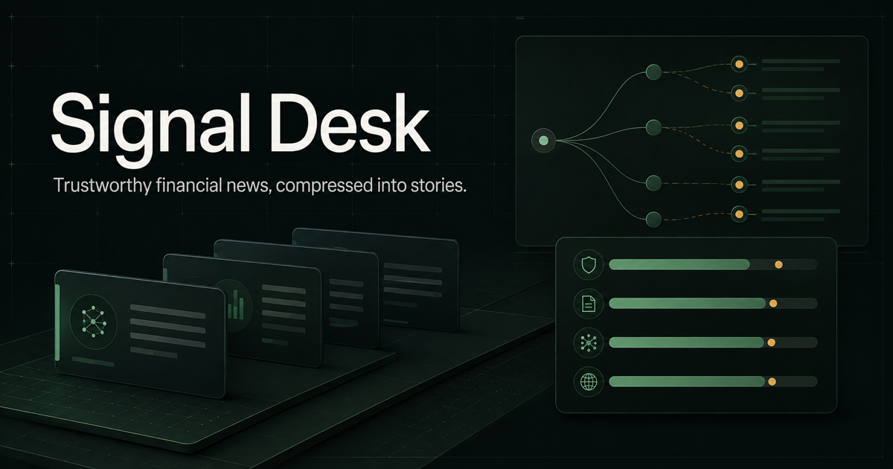

# Signal Desk — Trustworthy Financial News Inbox

Signal Desk turns a noisy public headline stream into a persistent, evidence-linked story inbox for US technology research.

It groups related coverage into stable stories, keeps independent publisher families visible, separates relevance from importance and credibility, and remembers what the researcher has read, saved, or dismissed. The product is designed for information triage; it does not predict returns or produce trading recommendations.



   

## What this project demonstrates

- **Product judgment:** duplicate reduction, evidence lineage, source health, and user workflow come before generative summaries or trading signals.
- **Data engineering:** typed providers, bounded concurrent ingestion, conditional HTTP requests, retry-after state, normalized timestamps, and last-good persistence.
- **Information retrieval:** explainable lexical story clustering with stable identities across refreshes.
- **Financial domain modeling:** watchlist entities, material event types, source tiers, independent publisher families, and separate scoring dimensions.
- **Full-stack implementation:** Cloudflare D1 persistence, API mutation boundaries, responsive React workspace, and durable research state.
- **Governance:** headline metadata only, original links preserved, explicit sample mode, source-level failure visibility, and documented licensing/data-rights boundaries.

## P0 workflow

1. Five registered inputs are checked on their own cadence: four focused Google News RSS searches and one official SEC EDGAR filing feed.
2. Each provider returns the same raw-item contract. The pipeline normalizes URLs, publishers, timestamps, watchlist entities, and event types.
3. Related headlines are assigned to a persistent story identity using token/bigram similarity plus entity, event, and numeric checks.
4. Each story exposes four independent scores: relevance, importance, credibility, and freshness.
5. The researcher works from `My Watchlist`, `Market`, or `Trending`, switches between grouped stories and raw wire records, and persists read/save/dismiss state.
6. Source health shows success, empty, stale, error, or backoff state while previously ingested stories remain available.

## Current product surface

- Three research views: My Watchlist, Market, and Trending
- Grouped-story and raw-wire modes
- Search, ticker, event-type, state, and ranking controls
- Stable story clusters with publisher-family corroboration
- Evidence detail pane with original source links
- Published, first-ingested, and last-updated timestamps
- Read, unread, saved, dismissed, and restored states
- Per-source latency, item count, last success, failure streak, and backoff state
- Live, cached, partial, and explicitly labeled demonstration modes
- Responsive desktop and mobile layouts

## Architecture

```text
Source registry
  ├─ Google News RSS providers
  └─ SEC EDGAR Atom provider
             │
             ▼
Bounded acquisition
timeout · ETag · Last-Modified · Retry-After · cadence
             │
             ▼
Canonical events
publisher family · source tier · published/ingested time
             │
             ▼
Stable story engine
lexical similarity · entity/event checks · persistent cluster ID
             │
             ▼
Cloudflare D1
sources · runs · events · clusters · members · user state
             │
             ▼
React research workspace
watchlist · market · trending · wire · evidence · workflow state
```

Key implementation areas:

- [`lib/news/config.ts`](lib/news/config.ts) — source and watchlist registries
- [`lib/news/providers.ts`](lib/news/providers.ts) — RSS and SEC provider contract
- [`lib/news/clustering.ts`](lib/news/clustering.ts) — independently authored story matcher
- [`lib/news/scoring.ts`](lib/news/scoring.ts) — component scores and ranking explanation
- [`lib/news/store.ts`](lib/news/store.ts) — D1 schema access and durable state
- [`db/migrations/0001_p0.sql`](db/migrations/0001_p0.sql) — auditable initial migration
- [`docs/P0_RELEASE_CONTRACT.md`](docs/P0_RELEASE_CONTRACT.md) — scope, acceptance, and rollback contract

## Run locally

Requirements: Node.js 22.13 or later.

```bash
npm install
npm run dev
```

Open [http://localhost:3000](http://localhost:3000). Vinext and Miniflare create project-local D1 state automatically; no API key is required.

For a production compilation:

```bash
npm run build
```

## Scoring boundary

The overall priority score orders reading only. It is a weighted presentation of four visible components:

- `relevance`: relationship to the configured watchlist or a broad macro event;
- `importance`: materiality of the detected event type;
- `credibility`: publisher tier plus independent publisher-family corroboration;
- `freshness`: observed time since publication.

The weights and event rules are engineering hypotheses. They have not been validated as predictors of price direction or returns. The next empirical step is a labeled headline/story dataset measuring cluster and entity precision.

## Data, reliability, and legal boundary

- Signal Desk stores headline metadata and outbound links, not publisher article bodies.
- Google News search results are a discovery sample and cannot establish complete market coverage.
- SEC access is identified and bounded; SEC or network policy may still reject a request, which appears as a source-level error while last-good data remains visible.
- Every enabled source needs a current rights review before full text, redistribution, embeddings, or model training are added.
- Demonstration records are explicitly labeled and never presented as real events.
- The project contains no BUY/SELL output, automated execution, or investment advice.

## Research basis

The P0 scope was selected after reviewing 48 representative products and repositories across institutional terminals, AI/event intelligence, trader news, retail/social tools, RSS readers, and open-source implementations.

- [`research/financial-news-product-landscape-2026-09-03.md`](research/financial-news-product-landscape-2026-09-03.md) — product and architecture decision
- [`research/product-inventory.csv`](research/product-inventory.csv) — 48-product updateable inventory
- [`research/report-source.md`](research/report-source.md) — fixed-commit code and source ledger

## License

[MIT](LICENSE). External news and filing content remains subject to its original source terms.
