# 金融新闻 Dashboard 产品与代码全景

**研究快照：2026-09-03**

**适用项目：Signal Desk — Financial News Dashboard MVP**

**研究对象：48 个代表产品/项目，31 个商业或闭源产品，17 个开源仓库**

## 1. 结论先行

Signal Desk 下一阶段最值得做的产品形态是：

> **可信故事收件箱（Trustworthy Story Inbox）**：把大量重复标题压缩成少量“故事”，明确来源、时间、相关标的、事件类型、可信度与市场上下文，让用户快速完成“读、忽略、保存、追踪”。

当前 MVP 已经证明了 RSS → 分类 → 排序 → 展示的最短链路。它还没有证明三件更重要的事：

1. 收到的新闻是否覆盖了用户真正需要的事件；
2. 排在前面的新闻是否真的值得看；
3. 用户看完后能否形成可追踪的研究动作。

所以，下一阶段不应先增加几十个花哨模块，也不应先上“AI 买卖信号”。先建立可信的数据与反馈闭环：

```text
来源目录
  → 稳定采集
  → 统一事件结构
  → 跨来源故事聚类
  → 标的/事件/价格上下文
  → 用户阅读与保存状态
  → 质量指标和反馈
```

竞争产品的共同结论很清楚：

- Bloomberg、LSEG、FactSet、S&P 的壁垒来自“信息和用户持仓/工作流的连接”，单纯新闻列表价值有限。
- AlphaSense、Bigdata.com、Fiscal.ai、Quartr 的核心是“可追溯的搜索和总结”，答案必须回到原始材料。
- RavenPack、Dataminr 把实体、事件、相关性、新颖度、可信度拆成独立字段，避免用一个神秘总分掩盖不同问题。
- Benzinga Pro、Newsquawk、TradeTheNews 竞争的是延迟和筛选；Signal Desk 当前没有付费低延迟数据，不能假装参与这个赛道。
- Feedly、Inoreader、Miniflux、Folo 说明真正高频的个人价值来自过滤、静音、已读、稍后读、规则和摘要。
- 开源项目里，WorldMonitor 的故事身份与来源治理、OpenBB 的 provider 抽象、Miniflux 的采集可靠性、alphai-tui 的请求预算和信息架构最值得借鉴。

## 2. 研究边界

“全网所有产品”无法被严格证明：私有内部工具、区域产品、刚发布或停止维护的项目持续变化。本研究把“全部”落实为三个可验证标准：

- **类别覆盖完整**：机构终端、AI/事件情报、交易新闻、零售工作台、通用情报/RSS、开源实现六类均覆盖；
- **代表产品可追溯**：每个条目至少有官方页面或可检查仓库；
- **目录可扩展**：全部 48 个候选保存在 [`product-inventory.csv`](product-inventory.csv)，以后可以继续追加和重评。

证据等级：

| 等级 | 含义 |
|---|---|
| A | 当前官方文档/API 文档，或本次已检查具体代码与许可证 |
| B | 当前官方产品页/帮助页，能确认能力，但未获得完整试用账号 |
| C | 营销首页、历史材料或受限页面，仅适合确认产品存在和大方向 |

限制：本轮没有购买商业账号，没有对供应商延迟、覆盖率和定价做真实订阅测试，也没有完成逐一来源的法律审查。商业产品能力来自官方材料；开源判断来自 2026-09-03 的仓库快照。Stars 只表示关注度，不代表代码质量。

## 3. 第一性原理：用户真正购买的是什么

金融新闻产品解决的不是“没有新闻”。供给早已过量。用户付费购买的是以下四种压缩：

1. **覆盖压缩**：把分散来源放进统一入口；
2. **重复压缩**：把十几条相似标题合成一个持续更新的故事；
3. **决策压缩**：解释它与我的标的、主题、事件窗口有什么关系；
4. **时间压缩**：在适当的时间通过适当渠道提醒，而非持续制造噪音。

Signal Desk 的核心任务可以写成一句可检验的话：

> 对给定 watchlist 和主题，在保留来源证据的前提下，把原始标题流压缩成不重复、可解释、可处置的故事队列。

这也定义了产品边界：系统负责收集、组织、解释证据；任何收益预测、BUY/SELL 指令或自动交易都需要单独验证，不应由新闻排序分数偷偷承担。

## 4. 市场地图：六类产品分别值得学什么

| 类别 | 代表产品 | 用户购买的核心价值 | Signal Desk 应借鉴 | 不应模仿 |
|---|---|---|---|---|
| 机构终端 | Bloomberg、LSEG、FactSet、S&P Capital IQ Pro、Morningstar Direct、IBKR TWS | 多数据源、持仓上下文、联动窗口、团队工作流 | watchlist/portfolio 相关性、可保存工作区、定时摘要、图表联动 | 在没有数据合同和覆盖证明时宣称“机构级” |
| AI/事件情报 | AlphaSense、RavenPack、Dataminr、Bigdata.com、Fiscal.ai、Quartr、Perplexity Finance | 搜索、结构化事件、原始文档、可追溯答案 | claim-level citation、事件本体、相关性/新颖度分离、文档时间线 | 把模型生成文本当事实来源 |
| 交易新闻 | Benzinga Pro、Newsquawk、The Fly、MT Newswires、TradeTheNews | 更低延迟、人工筛选、音频 squawk、催化剂日历 | 快速模式、Why it matters、事件日历、分级提醒 | 用免费 RSS 冒充实时 wire |
| 零售工作台 | Koyfin、TradingView、Finviz、Seeking Alpha、Yahoo Finance、Investing.com、Stocktwits、TipRanks、Unusual Whales、Quiver | 低门槛 watchlist、图表、提醒、社区/另类数据 | 过滤器、跨端提醒、价格上下文、portfolio exposure | 把社交热度等同于真实性或预期收益 |
| 通用情报/RSS | Feedly、Inoreader、Readwise Reader | 订阅、规则、静音、阅读状态、归档 | Boolean monitor、mute、稍后读、标签、笔记、导出 | 无差别把所有 feed 塞进首页 |
| 开源实现 | WorldMonitor、OpenBB、Miniflux、alphai-tui 等 17 项 | 可检查的数据流与交互实现 | provider、可靠采集、聚类、状态、可观测性 | 未核对许可证便复制代码或视觉 |

### 4.1 机构终端

- [Bloomberg Terminal](https://professional.bloomberg.com/products/bloomberg-terminal/)：Launchpad 式自定义监控、多资产数据、新闻、提醒和移动连续性。真正值得学的是“一个 symbol 驱动多个联动面板”。
- [LSEG Workspace](https://www.lseg.com/en/data-analytics/products/workspace)：Reuters 与多来源信息、桌面/网页/移动端统一；其 [Portfolio Manager](https://www.lseg.com/content/dam/data-analytics/en_us/documents/fact-sheets/final_re1570059_ws_ia_rpm_factsheet_portfolio_manager_a4_v6_web.pdf) 把新闻、事件、filing 和 upcoming events 放进 watchlist context；[AI Search](https://www.lseg.com/en/data-analytics/products/workspace/updates/act-with-the-same-confidence-at-a-new-speed-introducing-lseg-workspace-ai-search) 强调透明引用。
- [FactSet](https://insight.factset.com/hubfs/Resources%20Section/Brochures/solutions-for-portfolio-managers-brochure.pdf)：StreetAccount、portfolio/watchlist alerts、盘前/午间/收盘摘要和内部研究协作。Signal Desk 可以直接借鉴“三种摘要节奏”。
- [S&P Capital IQ Pro](https://www.spglobal.com/market-intelligence/en/solutions/news-and-insights)：个性化 News Homepage、聚焦提醒、情绪与 Chart Explainer。可借的是把价格变化和可能相关的新闻并列；因果关系必须标为解释性线索。
- [Morningstar Direct](https://www.morningstar.com/business/products/direct)：研究、数据、组合分析和报告模板处于同一工作流。其强项偏研究与组合管理，实时新闻并非本项目首要对标。
- [IBKR TWS](https://www.interactivebrokers.com/en/trading/tws.php)：Mosaic 将订单、图表、报价、watchlist、news 和 portfolio 放在可联动工作区。Signal Desk 只需要学习联动窗口，不需要接入交易执行。

### 4.2 AI 搜索与事件情报

- [AlphaSense](https://www.alpha-sense.com/solutions/market-intelligence-platform/)：跨 filings、transcripts、research、news 和内部资料搜索；Smart Summaries 保留原文片段引用；监控结果可形成 alert 与定时摘要。它给出的设计原则是“总结只是证据入口”。
- [RavenPack Edge](https://www.ravenpack.com/products/edge) 与 [Company News Factors](https://marketing-prod.ravenpack.com/products/edge/factors/company-news)：实体、事件类别、相关性、新颖度、媒体关注度、情绪和风险均为独立字段。Signal Desk 的 priority 不能继续承担所有含义。
- [Dataminr](https://www.dataminr.com/use-cases/financial-services/)：从大规模公开多模态来源发现早期事件并附加实体、位置、ticker 等元数据。它的能力依赖昂贵来源与实时基础设施，适合作为远期上限。
- [Bigdata.com](https://bigdata.com/developers)：搜索、retrieval、rerank、finance embeddings、knowledge graph、REST/SDK/MCP 与 cited grounding。可借鉴“检索层独立于生成层”。
- [Fiscal.ai](https://docs.fiscal.ai/docs/introduction)：公司新闻按事件类型与重要性过滤，并连接 filings、earnings events、transcripts、fund letters；其 [MCP skills](https://docs.fiscal.ai/docs/guides/mcp-skills) 强调数值回到 filing 页面。适合作为 primary-document context 的参照。
- [Quartr](https://quartr.com/features)：IR 文件、live call、transcript、slides、watchlist、keyword alert 和 recap；适合学习“事件包”：一次 earnings 事件包含公告、幻灯片、电话会和 transcript。
- [Perplexity Enterprise for Finance](https://www.perplexity.ai/gen/enterprise/finance)：以 SEC filings、calls、数据库和网页为引用基础。Signal Desk 只有在 citation coverage 可量化后才应加入相似问答。

### 4.3 低延迟交易新闻

- [Benzinga Pro Newsfeed](https://www.benzinga.com/pro/feature/newsfeed/) 提供来源、类别、watchlist、价格、市值和成交量等过滤；[Alerts](https://www.benzinga.com/pro/feature/alerts) 支持浏览器、邮件、声音与 workspace 级控制。可借鉴的是 rule granularity 和 “Why Is It Moving”。
- [Newsquawk](https://portal.newsquawk.com/features.html)：人类分析员过滤的低延迟音频/文本、saved search、calendar 与 analyst chat。免费 RSS 产品无法复制其数据与人工成本。
- [The Fly](https://www.thefly.com/)：紧凑实时 wire 与 portfolio-personalized feed。公开页面的细节有限，证据等级较低。
- [MT Newswires](https://www.mtnewswires.com/web-solutions)：新闻带 ticker/category 编码，可通过 API、FTP、RSS 嵌入。它证明 provider adapter 需要支持结构化 vendor feed。
- [TradeTheNews](https://www.tradethenews.com/)：24 小时 analyst、audio/text、calendar 与历史数据库。音频可放到远期提醒渠道，当前不应优先。

### 4.4 零售工作台与另类数据

- [Koyfin Alerts](https://www.koyfin.com/features/alerts/)、[Watchlist News](https://www.koyfin.com/help/watchlist-news-feature/) 和 [My Dashboards](https://www.koyfin.com/help/mydashboards-myd/)：来源/topic/filing filter、可复用 watchlist columns、可拖拽 widgets。最适合 Signal Desk 的是“watchlist 作为全局上下文”。
- [TradingView News Flow](https://www.tradingview.com/support/solutions/43000732560-news-flow-s-filters-overview/)：watchlist、instrument、market、sector、corporate activity、economics、country、provider 和 format 的组合过滤；[alerts](https://www.tradingview.com/support/solutions/43000520149-introduction-to-tradingview-alerts/) 跨设备、邮件和 webhook。可直接转化为过滤字段清单。
- [Finviz](https://finviz.com/help/screener)：新闻与 fundamentals/technicals/event signals 同处筛选器，说明新闻是 instrument research 的一个维度。
- [Seeking Alpha Portfolio](https://help.seekingalpha.com/what-are-the-key-features-of-seeking-alphas-portfolio-tracker)、[Yahoo Finance](https://finance.yahoo.com/subscriptions/) 与 [Investing.com](https://www.investing.com/mobile/?screen=markets)：共同模式是 watchlist/portfolio + news + event/price alerts。Signal Desk 应显示“与你的持仓/观察列表有什么关系”，先不做交易账户同步。
- [Stocktwits Symbol Page](https://help.stocktwits.com/c/navigating/articles/new-symbol-page)：实时社区流、bullish/bearish 投票和关注趋势。社交信号只能作为 attention 字段，不能提高来源可信度。
- [TipRanks Smart Portfolio](https://www.tipranks.com/news/labs/tipranks-ups-your-smart-portfolio-experience-with-two-new-features)：portfolio diagnostics、催化剂和可能价格驱动因素。可借鉴 exposure 和 catalyst，不复制黑箱评级。
- [Unusual Whales API](https://unusualwhales.com/public-api)：新闻、options、dark pool 与 streaming/API/MCP。适合远期“新闻 × 异常交易活动”上下文。
- [Quiver Quantitative](https://www.quiverquant.com/)：国会交易、insider、政府合同、游说、专利等另类数据。应建模为 typed events，与新闻平行存储。

### 4.5 通用情报与阅读器

- [Feedly AI Feeds](https://docs.feedly.com/article/699-guide-to-ai-feeds-market-intel)：模型、AND/OR/NOT、source bundle、board、automation；另有自然语言过滤与 mute。它是 saved monitor builder 的最佳闭源参考。
- [Inoreader](https://www.inoreader.com/pricing/feature/subscriptions/)：RSS、newsletter、social/web feeds、global search、monitoring、push 和 API；规则可以 tag/route，duplicate filter 减少噪音。
- [Readwise Reader](https://readwise.io/read)：RSS、newsletter、PDF、网页、视频统一阅读，带 highlight、note、全文检索和导出。它提醒我们：新闻被保存后会进入知识工作流，不能永远停留在首页卡片。

## 5. 开源代码审计：哪些实现真的值得学

本轮检查了 17 个仓库的当前默认分支、关键代码和许可证。完整 commit 与文件证据在 [`report-source.md`](report-source.md)。

### 5.1 第一梯队：直接影响下一阶段架构

| 项目 | 实现证据 | 值得借鉴 | 严格限制 |
|---|---|---|---|
| [WorldMonitor](https://github.com/koala73/worldmonitor) | `story-identity.js`、`dedup.mjs`、`news-credibility.js`、feed-health validator | 词/二元词/字符特征聚类；稳定 canonical story ID；publisher-family 去重；importance 与 credibility 分离；持续失败监控；LLM 有 deterministic fallback | AGPL-3.0；只能独立重写概念，不能复制进当前 MIT 项目后继续按 MIT 发布 |
| [OpenBB](https://github.com/OpenBB-finance/OpenBB) | provider registry、abstract fetcher、standard company-news model | provider `query → extract → transform` 合约；统一 schema；provider-specific capability map；扩展加载失败隔离 | AGPL-3.0-only；学习接口设计，独立实现 |
| [Miniflux](https://github.com/miniflux/v2) | feed/entry models、refresh handler、storage | ETag/Last-Modified；Retry-After；adaptive polling；错误计数；keep/block rules；持久化 read/star；全文检索；tombstone 防止已删除条目复活 | Apache-2.0 可在满足许可和 NOTICE/归属要求后复用；项目规模大，勿整体嵌入 |
| [alphai-tui](https://github.com/makeev/alphai-tui) | `source/registry.rs`、`poller.rs`、`app/feeds.rs` | 只轮询可见视图；请求预算；head/page/delta 不同 cadence；publish/ingest 双排序；cursor paging；已有数据不因新错误消失；cluster `×N` 与 unread | MIT；交互与缓存最适合轻量实现，但供应商 API 仍需单独授权 |

WorldMonitor 最值得吸收的设计有四条：

1. 同一故事的 wording 会变化，URL 去重和完全标题去重都不够；
2. cluster identity 必须跨刷新稳定，否则已读、提醒和故事生命周期会不断重置；
3. corroboration 应统计独立 publisher family，不能把 Reuters 的多个 feed 当成多个独立来源；
4. importance 回答“有多重要”，credibility 回答“来源有多可信”，两者应同时显示。

### 5.2 第二梯队：局部模式很有价值

| 项目 | 借鉴点 | 不能照搬的部分 |
|---|---|---|
| [mkt](https://github.com/stxkxs/mkt) | 每 feed 超时、并行获取、错误隔离；SEC EDGAR filing 与 news 共用 headline envelope | 仅 URL 去重、固定 feed 数量，规模小 |
| [Macro Dashboard](https://github.com/tduic/macro-dashboard) | source registry；market/news/macro 各自 TTL；dead feed 不拖垮 endpoint；stale/anomaly 状态；mover driver | 无许可证；规则简单；缺少持久化和用户状态 |
| [Financial Market Dashboard](https://github.com/sarsiz/Financial-Market-Dashboard) | SQLite `market_events`；published/fetched 分开；stable event id；索引和 upsert | 单体 `server.py`、硬编码数据和主观权重，原型味重 |
| [Fincept Terminal](https://github.com/Fincept-Corporation/FinceptTerminal) | SQLite history、FTS5、read/save、monitor、progressive loading、wire/cluster 两种视图、detail pane | LICENSE 同时写 AGPL 和额外商业/视觉限制；按高风险参考处理，不能复制代码或 trade dress |
| [Glance](https://github.com/glanceapp/glance) | YAML 页面/column/widget；per-widget cache；坏配置时保留上一份有效配置；移动适配 | AGPL；它是通用 dashboard，缺少新闻实体与故事层 |
| [RSSHub](https://github.com/DIYgod/RSSHub) | route registry、路由能力元数据、共享缓存、并发请求去重、广泛中文财经 route | AGPL；许多 route 涉及抓取；每个来源的条款、robots、全文权利都要单独审核 |
| [Folo](https://github.com/RSSNext/Folo) | timeline、curated list；AI summary/translation 有 global、rule、one-off 三层控制 | AGPL；AI 结果的来源约束需另行建立 |

### 5.3 第三梯队：用于评测或反面检查

| 项目 | 可以保留 | 必须拒绝 |
|---|---|---|
| [Breaking News Market Sentiment](https://github.com/ShaonINT/breaking_news_market_sentiment) | 事件 taxonomy、source-wise time series、sentiment/market correlation 试验框架 | 顺序抓取；跨来源重复未消除；VADER 平均情绪会掩盖实体、事件和立场差异；README 与代码 feed 数量漂移 |
| [FinRobot](https://github.com/AI4Finance-Foundation/FinRobot) | 确定性计算与 LLM narrative 分开；报告保留来源 | 多 agent 和预测远超当前产品需求；部分概率/评分缺少校准 |
| [FinGPT](https://github.com/AI4Finance-Foundation/FinGPT) | sentiment、NER、relation、headline 的任务与 benchmark 设计 | 大量研究 notebook/旧模型，不能直接视为生产服务；仓库也明确提醒任务外泛化有限 |
| [FinBERT](https://github.com/ProsusAI/finBERT) | 三分类概率可作为 baseline | 仓库基于较旧实现；只做 sentiment，无法解决 relevance、novelty、credibility 或 materiality |
| [Bloomberg Terminal clone](https://github.com/feremabraz/bloomberg-terminal) | 高密度 dark terminal、键盘和 split view 的一般模式 | 无许可证；部分市场数据是示例；不得复制 Bloomberg 品牌或外观 |
| [Financial Daily](https://github.com/Yang1Bai/finance-daily-site) | GitHub Actions 定时生成、日报 archive、RSS 输出、多渠道分发 | 无 LICENSE 文件；用 LLM web search 同时担任采集与判断；存在硬编码消息凭据；不能作为安全或事实架构参考 |

## 6. 把所有可用功能整合成一张能力地图

这张表是后续 backlog 的上位结构。新增功能必须归入其中，并回答“服务哪个用户决策”。

| 层 | 完整功能集合 | 当前 MVP | 建议阶段 |
|---|---|---|---|
| 来源治理 | RSS/Atom、官方 filings、IR、licensed API、transcript、calendar、market data、social/alt data；source tier、publisher family、地区/语言、数据权利、credential/cost | 4 个固定 Google News RSS 查询 | P0 先原生 RSS + SEC；P2 再付费/另类数据 |
| 采集可靠性 | provider adapter、并发、超时、重试、backoff、ETag、Last-Modified、Retry-After、streaming、请求预算、last-good、partial result、feed health | 8 秒超时；失败时 demo fallback | P0 全部建立，streaming 延后 |
| 标准化 | RSS/Atom/JSON 解析、encoding、timezone、canonical URL、published/updated/ingested、source/origin publisher、统一 event schema | 标题、时间、publisher、link | P0 |
| 故事层 | exact dedup、相似标题聚类、稳定 cluster ID、source family、first/last seen、story update、corroboration | 标题去重 | P0 核心 |
| 实体与分类 | company/ticker、sector、country、person、product、topic；earnings/guidance/M&A/regulatory/legal/product/macro 等事件本体；歧义消解 | 11 股票 + 6 类关键词 | P0 watchlist 精度；P1 扩展本体 |
| 情报字段 | relevance、novelty、importance、credibility、freshness、market reaction、sentiment、attention、velocity、confidence；解释每一项来源 | 单一 priority heuristic | P0 拆字段；P1 加市场反应；P2 sentiment/attention |
| 证据与 AI | exact snippets、claim citations、conflict detection、cluster summary、follow-up QA、deterministic fallback、model/prompt version、human feedback | 无 | P2，在质量数据完成后 |
| 核心界面 | My Watchlist / Market / Trending；wire/cluster；list-detail split；cluster timeline；来源比较；price/calendar/document context；移动响应 | 单页列表、filter、sort、search | P0 三视图 + detail；P1 context |
| 个人状态 | new/unread/read、save/read later、tag、note、highlight、history、mute、dismiss、feedback | 无 | P0 read/save；P1 notes/rules |
| 搜索过滤 | 全文、entity、event、sector、region、source、language、credibility、recency、content type；saved search；AND/OR/NOT；exclude/mute | 文本、ticker、category | P1 |
| 提醒摘要 | immediate/digest、quiet hours、throttle、cluster grouping、desktop/email/mobile/webhook/WeChat；morning/midday/EOD/weekly | 无 | P2；必须先通过误报门槛 |
| 协作输出 | comments、mentions、shared watchlist、notebook、memo、PDF/CSV、API/MCP、Obsidian/export | 无 | P2/P3，取决于个人或团队定位 |
| 治理测量 | coverage、freshness、latency、duplicate reduction、cluster/entity precision、citation coverage、alert precision、cost、audit log、privacy、secret handling、retention | sample/live 标签 | P0 开始记录 |

## 7. 推荐的统一产品架构

```mermaid
flowchart LR
  A[Source registry<br/>rights · tier · family · cost] --> B[Provider adapters<br/>RSS · SEC · API]
  B --> C[Ingestion control<br/>timeout · cache · retry · budget]
  C --> D[Canonical events<br/>published · ingested · source]
  D --> E[Story engine<br/>dedup · cluster · stable identity]
  E --> F[Intelligence<br/>entity · event · relevance · novelty · credibility]
  F --> G[Context<br/>price · volume · calendar · filings]
  G --> H[Views<br/>Watchlist · Market · Trending]
  H --> I[Workflow<br/>read · save · note · monitor · digest]
  I --> J[Quality loop<br/>labels · precision · coverage · cost]
  J --> E
```



### 7.1 Canonical event contract

下一阶段先冻结一个统一事件结构，任何来源都转换到它：

```text
event_id
source_id / source_name / publisher_family / source_tier
source_url / canonical_url
title / excerpt / language
published_at / updated_at / ingested_at
symbols[] / entities[] / sectors[] / regions[]
event_types[]
cluster_id / cluster_version
relevance / novelty / importance / credibility / confidence
evidence_urls[]
raw_payload_ref
```

用户状态单独保存，不能写回共享新闻对象：

```text
user_id / event_or_cluster_id
state: new | unread | read | saved | dismissed
tags[] / note / muted_until
first_seen_at / opened_at / acted_at
```

这样未来从 RSS 换到 paid API、从个人模式扩展到团队模式，不需要重写整个 UI。

### 7.2 排序模型必须可解释

拆成多列再决定排序，不要先造一个 0–100“智能分数”：

- `relevance`：与 watchlist、portfolio、saved themes 的关系；
- `novelty`：相对同一 cluster 过去内容新增了什么；
- `importance`：事件类型、波及范围、时间敏感性；
- `credibility`：来源级别、publisher family、独立 corroboration；
- `freshness`：发布时间与抓取时间；
- `market_reaction`：价格/成交量的已观察变化，不能写成已证明因果。

UI 应允许用户看见分项理由，例如：

```text
优先显示：NVDA 在 watchlist + earnings guidance + 3 个独立来源 + 18 分钟前
可信度：Tier 1 来源 + 2 个独立 publisher corroboration
市场上下文：发布后 30 分钟价格 +2.1%，成交量为同时间段中位数的 1.8×
```

## 8. 当前 MVP 的严格差距审计

| 问题 | 当前状态 | 风险 | 下一动作 |
|---|---|---|---|
| 覆盖 | Google News 4 个固定查询 | 结果采样不可控，官方 filing/IR 易被漏掉 | provider registry；先接原生 RSS 与 SEC EDGAR |
| 去重 | 标题规范化/URL 级思路 | 同一故事不同标题仍刷屏 | story cluster + publisher family |
| 时间 | 主要使用 publication time | feed 修改、抓取时间与时区问题不可审计 | 保存 published/updated/ingested 三时间 |
| 来源 | publisher 文本 + 少量质量 boost | aggregator 与原始 publisher 混淆；权重主观 | source registry、tier、origin、rights 字段 |
| 排序 | 一个透明 heuristic | relevance、importance、credibility 混合 | 分项存储，UI 显示排序理由 |
| 实体 | 11 个 ticker 关键词匹配 | ticker 歧义、别名和关联公司会误匹配 | entity registry + 人工标注集 |
| 持久化 | 无 | 无历史、无 read/save、无法测量 | SQLite |
| 错误处理 | 全失败时 demo fallback | 单个 feed 静默死亡、旧数据消失 | per-source status + last-good + stale badge |
| 用户闭环 | filter/sort/search | 不知道什么被读、保存或忽略 | read/save/dismiss + event log |
| AI | 暂无 | 现在加入会放大脏数据并制造伪精确 | P2 后置，先建立 evidence contract |

## 9. 下一阶段建议：P0「可信故事收件箱」

### 9.1 目标

在当前 11 个美股科技标的和少量市场主题上，把重复标题压缩成稳定故事，并让用户在一个页面完成：

1. 看今天有哪些独立故事；
2. 看故事为什么与我的 watchlist 有关；
3. 比较有哪些独立来源在报道；
4. 读原文、标记已读、保存或忽略；
5. 明确知道哪些来源失败、数据是否过期。

### 9.2 P0 必做

| 模块 | 最小实现 | 完成判据 |
|---|---|---|
| Source registry | YAML/TS 配置 source id、URL、type、language、tier、publisher family、enabled、rights note | UI/API 能列出每个来源及最近状态 |
| Provider contract | `fetch → normalize`；RSS 与 SEC 两个 provider | 单一 provider 失败不会让整体失败；错误有来源标签 |
| SQLite | events、story_clusters、cluster_members、sources、user_state、ingestion_runs | 刷新/重启后 history 与 read/save 不丢失 |
| 时间与 URL | published/updated/ingested；canonical URL；tracking 参数清理 | 每条记录能解释何时发布、何时收到 |
| Story clustering | exact + lexical similarity；24–96h 候选窗；稳定 canonical ID；publisher family count | 人工标注集上报告 precision/recall；跨刷新 ID 稳定 |
| Entity/event | 当前 11 ticker 的 alias registry；7–10 个 material event types | 人工样本报告 precision；歧义可回溯规则 |
| 排序 | relevance、importance、credibility、freshness 分项；排序理由 | 卡片能展示至少两个可读理由 |
| 页面 | `My Watchlist`、`Market`、`Trending`；cluster/wire toggle；右侧 detail pane | 核心流程无需换页；移动端仍可读 |
| 状态 | new/unread/read/saved/dismissed | 状态跨刷新持久化；cluster 更新后不会无故重置 |
| Health | per-source success/error/empty/stale、latency、last success、last-good data | 零静默失败；stale 明示，不用 demo 假装 live |
| 基线指标 | ingestion success、freshness、raw→cluster reduction、entity precision、open/save/dismiss | dashboard 或日志能输出每日快照 |

### 9.3 P0 明确不做

- 抓取付费墙后的全文；
- 声称覆盖“所有金融新闻”；
- BUY/SELL、价格预测、自动交易；
- 全局正负情绪大盘；
- 微信、邮件、mobile push 等外部提醒；
- 多 agent 自动研究；
- 复杂 team/RBAC；
- 模仿 Bloomberg、Fincept 等受保护品牌和 trade dress。

### 9.4 建议工程门槛

下列数字是待确认的工程目标，不是已经达到的结果：

- 连续 7 天 ingestion run 可见，任何失败均有 source-level reason；
- 人工标注故事对上，cluster precision 目标 ≥95%，宁可少合并，先避免错误合并；
- 当前 11 个 watchlist 标的 entity precision 目标 ≥95%；
- 同一故事跨连续刷新保持同一 cluster identity；
- 所有卡片保留原始 URL、publisher、published_at 和 ingested_at；
- stale 或 partial 数据在 UI 明示；
- 100 条人工审查样本形成第一版 ground truth。

这些门槛需要用真实样本校准。没有样本时，任何 0–100 分数都只是设计意见。

## 10. 后续阶段

### P1：上下文与可编程过滤

- price/volume reaction strip；
- earnings、macro、SEC filing calendar；
- 全文索引仅覆盖有权保存的内容，其他来源只索引 metadata；
- saved searches、AND/OR/NOT、mute/exclude；
- notes、tags、highlights；
- story timeline 和 source comparison；
- morning / midday / EOD digest preview，先只在产品内生成。

### P2：提醒与有证据的 AI

- grouped cluster alerts、quiet hours、throttle、destination policy；
- 先测 100–200 个候选提醒，建议误报率目标 ≤10%，再启用外部渠道；
- cluster summary 必须逐 claim 绑定 source URL/snippet；
- source conflict / missing evidence 明示；
- deterministic fallback；
- FinBERT/FinGPT/通用 LLM 在同一标注集上比较，选择成本最低且满足质量门槛的方案；
- daily/weekly research memo 可回到每条证据。

### P3：团队与数据商业化准备

- shared watchlists、comments、mentions、assignment、audit log；
- portfolio import 与 exposure；
- licensed vendor APIs；
- API/MCP/export；
- retention、permissions、data contracts、vendor cost monitoring。

## 11. 数据、许可和安全红线

1. **内容权利**：默认只保存 headline、metadata 和原始链接；任何正文保存、重分发、向量化或模型训练都需要按来源审查条款。
2. **官方数据优先**：SEC 的 [EDGAR APIs](https://www.sec.gov/search-filings/edgar-application-programming-interfaces) 不要求 API key，submissions/XBRL 在日内更新；自动访问仍需遵守 [Fair Access](https://www.sec.gov/about/developer-resources)，总请求不超过其当前指南并使用可识别客户端。
3. **许可证**：AGPL 项目的代码不能直接复制到当前 MIT 仓库后继续把组合整体当 MIT 发布。无 LICENSE 的仓库按未获复制授权处理。Apache/MIT 也需要保留相应版权、许可证和 NOTICE 要求。
4. **商标/视觉**：Bloomberg clone 或 Fincept 的视觉只能当一般布局参考；不要复制品牌、命令语言、独特 trade dress。
5. **秘密管理**：API key、webhook token、chat id 只能来自环境变量/secret store；本次审计已发现公开示例项目存在硬编码消息凭据，不能沿用。
6. **LLM 边界**：LLM 不生成 publisher、URL、publication time、价格或 filing 数值；这些字段来自结构化来源。生成失败或 grounding 失败时回退到 deterministic 输出。

## 12. 下一次决策会议只需要回答八个问题

1. 第一用户到底是 Titus 个人、3–10 人研究小组，还是公开用户？
2. 未来 90 天仍聚焦美股科技，还是立即扩展全球多资产？
3. 延迟目标是秒级、5 分钟、30 分钟，还是日内即可？
4. 可接受的月度数据与模型预算是多少？
5. 是否允许只展示 headline/link，还是已经拥有可保存全文的来源？
6. watchlist 是否需要真实持仓权重，还是只需要关注列表？
7. 最重要的处置动作是“阅读、保存、写 memo、提醒、分享”中的哪两个？
8. 成功定义是什么：每天节省时间、减少重复、提高重要新闻召回、降低漏报，还是形成可审计研究记录？

如果这八个问题没有冻结，继续加功能会制造一个宽而浅的资讯门户。P0 可以先用当前假设推进：个人/小组、美股科技、分钟级、低成本、headline/link、watchlist、阅读+保存、以去重与精度为成功指标。

## 13. 当前建议的决策

**建议批准 P0「可信故事收件箱」，暂缓 AI 总结和外部提醒。**

原因：P0 同时解决当前 MVP 最严重的覆盖、重复、持久化、可信度和反馈缺口；它也为后续的 AI、提醒、团队和付费数据提供稳定接口。若现在跳到 AI 摘要，模型只会把不稳定的 RSS 样本和错误聚类包装成更流畅的文字。

详细 48 项目录见 [`product-inventory.csv`](product-inventory.csv)，可复核研究记录见 [`report-source.md`](report-source.md)。
